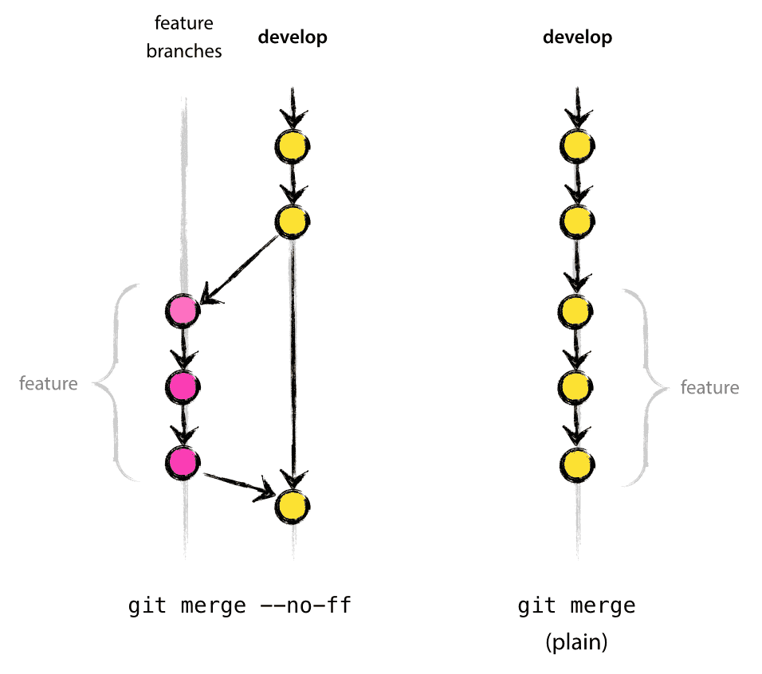

# 生产项目 Git 配置

- [生产项目 Git 配置](#生产项目-git-配置)
	- [`git merge --no-ff`](#git-merge---no-ff)

## `git merge --no-ff`

> `git config --global merge.ff no`

使用 `--no-ff` 标志后，即使合并可以通过快进执行，也会始终创建一个新的提交对象。这样可以避免丢失特性分支历史存在的信息，并将共同添加该特性的所有提交组合在一起。比较

在 `fast-forward` 情况下，我们无法从 Git 历史记录中看到哪些提交对象一起实现了某个特性，而必须手动阅读所有日志信息。在后一种情况下，还原整个特性（即一组提交）确实是个令人头疼的问题，而如果使用 `--no-ff` 标志，就很容易做到。

是的，这会多创建几个（空）提交对象，但收益远大于代价。