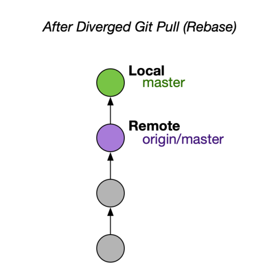

# 生产项目 Git 配置

- [生产项目 Git 配置](#生产项目-git-配置)
	- [`git merge --no-ff`](#git-merge---no-ff)
	- [`git pull --ff-only`](#git-pull---ff-only)

## `git merge --no-ff`

> `git config --global merge.ff no`

使用 `--no-ff` 标志后，即使合并可以通过快进执行，也会始终创建一个新的提交对象。这样可以避免丢失特性分支历史存在的信息，并将共同添加该特性的所有提交组合在一起。比较

在 `fast-forward` 情况下，我们无法从 Git 历史记录中看到哪些提交对象一起实现了某个特性，而必须手动阅读所有日志信息。在后一种情况下，还原整个特性（即一组提交）确实是个令人头疼的问题，而如果使用 `--no-ff` 标志，就很容易做到。

是的，这会多创建几个（空）提交对象，但收益远大于代价。

## `git pull --ff-only`

> `git config --global pull.ff only`

在默认模式下，git pull 是 git fetch 后跟 git merge FETCH_HEAD 的简写。这通常会创建合并提交。因此，默认情况下，从远程拉取并不是一个无害的操作：它可以创建一个以前不存在的新提交 sha！这种行为让 Git 新手感到困惑，因为看似无害的下载操作实际上会以不可预测的方式更改提交历史记录。

另一个问题是当位于不同的分支时。如果已签出 my-branch 并运行 git pull origin master ，这不仅仅会更新的本地 master。相反，Git 会很乐意将 origin/master 合并到您的分支中！

> 另一种流行的设置是使用 git pull 的 --rebase 选项而不是 --ff-only 。从视觉上看，如果本地和远程有分歧, --rebase 还会永久改变当前分支的历史记录

通过使用 `--ff-only` ，您可以确信，无论本地存储库的状态如何，您都不会更改版本历史记录。将下载与提交创建分开使 Git 更易于理解。